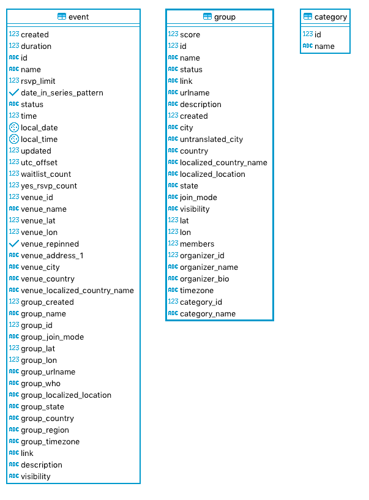
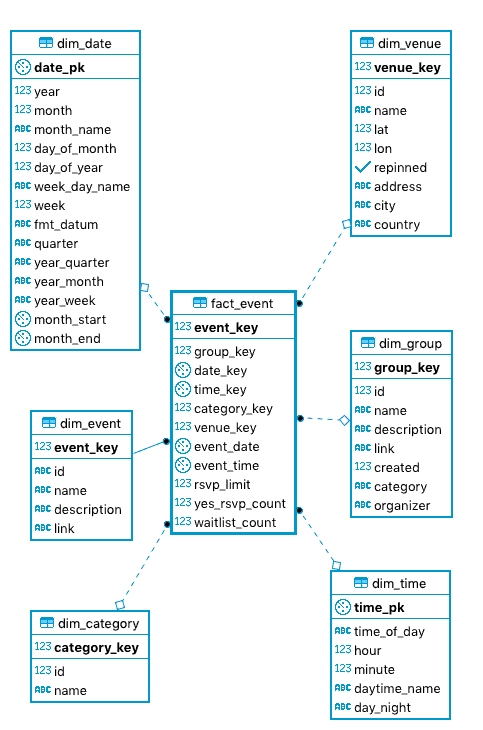
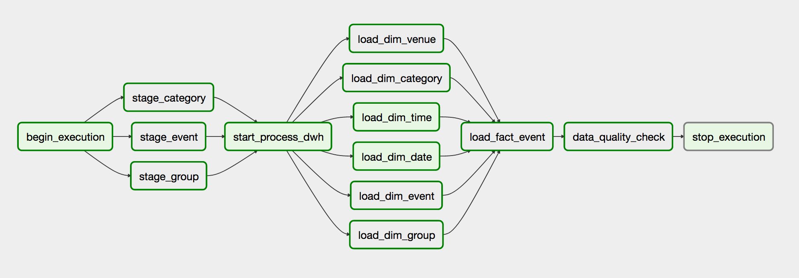
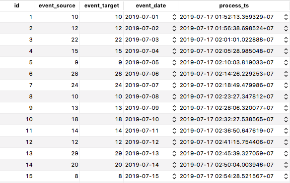

## ETL Meetup Events

This project consists of 4 steps:

1. Get the Meetup events from [official API](https://www.meetup.com/meetup_api/) and load into PostgreSQL
2. Create our data warehouse and perform ETL
3. Automate ETL with Apache Airflow 
4. Set up dashboard and SQL analytics


### 1. Get the Meetup events and load into PostgreSQL




1. Modify your environments in `api/.env`
2. Run `cd api && ./init.sh`

### 2. Create our data warehouse and perform batching ETL 



1. In `dwh/setup/export_db.sql`, specify the date range in the `WHERE` clause so that we can experiment on incremental load
2. Run `cd dwh && ./etl.sh`

Note: There are some duplicate rows but the constraint of unique id automatically solves that problem!

```
-- verify that there are some duplicate rows

SELECT 
	COUNT(*), id
FROM staging."event"
GROUP BY
	id
HAVING 
	COUNT(*) > 1`
```

### 3. Incremental load with Apache Airflow 




1. Copy every file in `meetup_dags` folder to your Airflow dag 
2. Create the `sql_dwh_path` variable in Airflow UI and point that to your sql directory, e.g. `/Users/john/airflow/dags/sql`
3. create 2 connections in Airflow UI: `postgres_oltp` and `postgres_dwh`
```
{
   "conn_id":"postgres_oltp",
   "conn_type":"postgres",
   "host":"localhost",
   "port":5432,
   "schema":"meetup",
   "login":"john",
   "password":""
}
 
{
   "conn_id":"postgres_dwh",
   "conn_type":"postgres",
   "host":"localhost",
   "port":5432,
   "schema":"dwh",
   "login":"dwh_owner",
   "password":"dwh_owner"
}
```
4. Set up airflow pool to limit the execution parallelism `'postgres_dwh': 10`
5. Start our DAG 
6. Now, Airflow will start performing incremental loads



With the data_quality_check operator, we can guarantee that every row has been inserted into dwh.

### 4. Setup Dashboard, OLAP and analytics

#### Dashboard
I decided to use Metabase as the BI tools because it is n open source Business Intelligence server.

[](https://vimeo.com/352247420 "Meetup Dashboard - Click to Watch!")

#### Jupyter notebook

1. `dataframe.ipynb`: example of using Pandas with Meetup events
2. `sql.ipynb`: SQL analytics including OLAP and window functions


